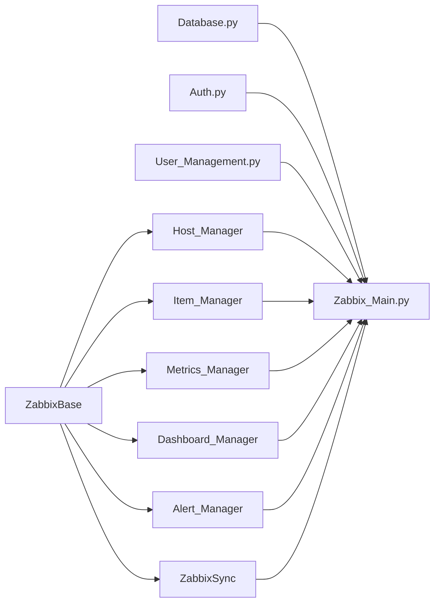

# CLAUDE.md

This file provides guidance to Claude Code (claude.ai/code) when working with code in this repository.

## Code conventions

- **Variables in code:** whenever you write a variable that the user needs to fill in (CI variables, image names, URLs, tokens, credentials, runner tags, etc.), always use a descriptive dummy name (e.g. `<your-oc-image>`, `staging-runner`, `STAGING_TOKEN`) and add an inline comment explaining exactly what it is and where it needs to be changed. Never leave a variable placeholder without a comment.

---

## What this project is

A full-stack DevOps UI for managing a Zabbix monitoring server with role-based access control, team management, and a PostgreSQL user database. The backend exposes a REST API that wraps the Zabbix JSON-RPC API and manages users/teams; the frontend is a Next.js app that calls it. Primary operations: login/auth, manage teams and users, list/create/delete hosts, add monitoring items and triggers, bulk-import hosts from CSV/XLSX, export inventory to Excel, view live metrics & problems, build dashboards, and define custom alert rules.

The repo is set up for **air-gapped / private-registry** deployment on **OpenShift** (or vanilla Kubernetes), with Helm charts deployed directly via GitLab CI (`helm upgrade --install`) across staging / production / DR. ArgoCD manifests exist in `argocd/` as a planned future GitOps path but are **not yet wired into the pipeline**.

---

## Monorepo layout

```
apps/
  backend/          Python 3.12 / FastAPI — Zabbix wrapper + PostgreSQL user/team DB
  frontend/         React 18 / Next.js 15 App Router / TypeScript / MUI
helm/
  charts/
    backend/        standalone Helm chart
    frontend/       standalone Helm chart
    zabbix-portal/  umbrella chart depending on backend + frontend
argocd/             AppProject, ApplicationSet, per-env values (planned — not yet active)
.gitlab/ci/         modular GitLab CI pipeline
docker-compose.yml  local orchestration (backend + frontend)
```

PostgreSQL is a **shared/external** database — it is not in `apps/` and not deployed by Helm. The backend connects to it via `DATABASE_URL`.

---

## Development commands

### Backend (from `apps/backend/`)

```bash
python -m venv .venv && source .venv/bin/activate
pip install -r requirements.txt

# Dev server (port 6769)
uvicorn Zabbix_Main:app --host 0.0.0.0 --port 6769 --reload

# Lint / format
ruff check . && ruff format --check .

# Type-check
mypy . --ignore-missing-imports
```

### Frontend (from `apps/frontend/`)

```bash
npm install

# Dev server (Next.js on :42069, proxies /api → :6769 via route handler)
npm run dev

# Build / lint / typecheck
npm run build       # next build
npm run lint        # Biome
npm run typecheck   # tsc

# Format whole repo (from repo root)
npm run format
```

### Docker (each app built independently)

```bash
# Backend — build context is apps/backend/
docker build -t zabbix-portal-backend apps/backend/

# Frontend — build context is apps/frontend/ (Dockerfile lives there)
docker build -t zabbix-portal-frontend apps/frontend/
```

The easiest way to run both app services together is docker compose from the repo root:

```bash
# Build and start backend + frontend (PostgreSQL is external — set DATABASE_URL)
docker compose up -d --build

# Tear down
docker compose down
```

The two services share the default compose network and reach each other by container name. PostgreSQL is not part of compose — point `DATABASE_URL` at the shared database.

To run containers individually without docker compose:

```bash
docker network create zabbix-net

docker run -d --name backend --network zabbix-net \
  --env-file apps/backend/.env \
  -p 6769:6769 \
  zabbix-portal-backend

docker run -d --name frontend --network zabbix-net \
  -p 42069:42069 \
  zabbix-portal-frontend
```

Set `BACKEND_URL=http://backend:6769` in `apps/frontend/.env` when both containers are on the same network, and point `DATABASE_URL` in `apps/backend/.env` at your shared PostgreSQL (use its reachable host/IP, not `localhost`).

---

## Backend architecture



- **`ZabbixBase`** loads `apps/backend/.env` and creates a `zabbix_utils.ZabbixAPI` session. All Zabbix managers inherit from it. `self.zapi` is `None` when Zabbix is unreachable — callers must guard against this. Exposes `close()` (called for every manager on app shutdown); honours `ZABBIX_SSL_VERIFY`.
- **`Host_Manager`** wraps host CRUD and Excel export (`openpyxl` / `pandas`).
- **`Item_Manager`** wraps item and trigger creation. Trigger expressions follow Zabbix 5.x classic format: `{hostname:item_key.last()} operator threshold`.
- **`Metrics_Manager`** reads active problems and item history time-series from Zabbix.
- **`Dashboard_Manager`** lists native Zabbix graphs, proxies graph images, returns Chart.js series, and aggregates per-host last-value metrics.
- **`Alert_Manager`** owns user-defined alert rules and events. Its `run_checks()` runs on a 60-second background thread, evaluating thresholds and recording ok→firing transitions.
- **`ZabbixSync`** performs bidirectional user/group/host-group sync between the portal DB and Zabbix, including real-time sync via a PostgreSQL `LISTEN/NOTIFY` channel and a periodic background sync.
- **`Database.py`** owns a `psycopg2.pool.ThreadedConnectionPool`, creates the schema on `init_db()`, and runs idempotent migrations. `get_conn()` returns a pooled connection whose `close()` returns it to the pool. Tables: `teams`, `team_users` (with `roles TEXT[]`), `host_assignments`, `dashboard_layouts`, `alert_rules`, `alert_events`.
- **`Auth.py`** handles password hashing (`bcrypt`), JWT creation/validation (`python-jose`), and FastAPI dependency functions: `get_current_user`, `require_root`, `require_admin`, `require_operator`. Also exports `can_grant_roles()` — the guard that prevents users from granting roles higher than their own.
- **`User_Management.py`** contains all SQL queries for users, teams, host assignments, dashboard layouts, and the overview aggregation. `seed_root()` seeds a root user on first startup from `ADMIN_USERNAME` / `ADMIN_PASSWORD` (default `Admin` / `admin`, with a logged warning if no password is set).
- **`Zabbix_Main.py`** instantiates all managers at module load and runs startup work (`init_db()`, `install_notify_triggers()`, `seed_root()`, sync bootstrap, alert-checker thread) inside a FastAPI **`lifespan`** context manager; manager `close()` runs on shutdown. All route handlers live here. There is no dependency injection.
- FastAPI runs on **port 6769** locally and in Docker/Kubernetes. A Server-Sent Events stream at `/events` pushes sync notifications to connected clients.

Required environment variables (in `apps/backend/.env`):

```
ZABBIX_URL=http://your-zabbix-server
ZABBIX_USER=Admin
ZABBIX_PASS=zabbix
ZABBIX_SSL_VERIFY=true        # set false only on a trusted net with a self-signed cert

DATABASE_URL=postgresql://postgres:postgres@<db-host>:5432/zabbix_portal

# Long random string — generate with: python -c "import secrets; print(secrets.token_hex(32))"
SECRET_KEY=change-me-in-production

ADMIN_USERNAME=Admin          # seed root username (first boot only)
ADMIN_PASSWORD=change-me      # seed root password; defaults to 'admin' with a warning if unset

BACKEND_URL=http://localhost:6769
```

- `DATABASE_URL` — PostgreSQL connection string for the shared/external database. The backend creates the schema and runs migrations on every startup (idempotent).
- `ZABBIX_SSL_VERIFY` — TLS verification for the Zabbix API connection probe; `true` by default.
- `SECRET_KEY` — signs JWT tokens. **Must be changed before any real deployment.** If rotated, all existing tokens are immediately invalidated.
- `ADMIN_USERNAME` / `ADMIN_PASSWORD` — seed the root account on first boot only.
- `BACKEND_URL` — consumed by the frontend, not the backend itself — it lives here so there is one `.env` file to maintain.

These can be supplied in two ways:
- **Local development** — place them in `apps/backend/.env` (loaded by `python-dotenv`).
- **Kubernetes / OpenShift** — inject them via a ConfigMap (non-sensitive values) or Secret (`ZABBIX_PASS`, `SECRET_KEY`, DB password). Mount via `envFrom`. Do not bake `.env` files into container images.

The Zabbix URL is normalised — either `http://host` or `http://host/api_jsonrpc.php` works.

---

## Frontend architecture

- All API calls go through the thin client in `src/app/api.ts`. Every call is prefixed with `/api` — all environments route through the same Next.js route handler. The client holds the JWT in `localStorage` and attaches it as a `Bearer` token on every request. On a 401 it clears the token and redirects to `/login` (except during the login call itself, which passes `{ skipRedirect: true }`).
- **API proxying** — `src/app/api/[...path]/route.ts` is a catch-all route handler that proxies every `/api/*` request to `BACKEND_URL` at request time. `BACKEND_URL` defaults to `http://localhost:6769` if not set.
- **`BACKEND_URL` loading** — `src/instrumentation.ts` runs `dotenv.config()` once at server startup, loading `apps/frontend/.env` (baked into the image at build time). In dev, Next.js loads `.env` automatically.
- **Auth context** — `src/app/context/AuthContext.tsx` holds the decoded JWT payload (`AuthUser`: `id`, `username`, `roles: string[]`, `team_id`). Consumed throughout the app via `useAuth()`.
- Routing: Next.js App Router (`src/app/`). Routes: `page.tsx` (/ → Overview), `dashboard/page.tsx`, `hosts/page.tsx`, `items/page.tsx`, `teams/page.tsx`, `metrics/page.tsx`, `users/page.tsx`, `login/page.tsx`. Each thin page file re-exports the real view component from `src/views/`. There is also `src/middleware.ts` and `src/lib/auth.ts` for edge auth handling, and `SyncContext` (SSE) / `ThemeContext` providers.
- Root layout: `src/app/layout.tsx` (server component — html/body/AppRouterCacheProvider). Providers: `src/app/providers.tsx` (client boundary — ThemeProvider + AppShell). The login page bypasses AppShell.
- Theme: `src/app/theme.ts` (MUI v5, dark/light toggle persisted in `localStorage`).
- Shell: `src/app/layout/AppShell.tsx` — polls `/api/health` every **15 s** and shows live status dots (green/red) for Backend API and Zabbix in the sidebar. The Users nav item is hidden for non-admin roles (`root` and `team_lead` can see it).
- No global state manager — components call `api.*` directly.
- All page components are client components (`'use client'`) because they use React hooks and browser APIs.

### Frontend code style

- **Always use arrow-function syntax** for all functions — components, hooks, helpers, callbacks. Never use the `function` keyword.

```tsx
// correct
const MyComponent = () => { ... };
const useMyHook = () => { ... };
const handleClick = () => { ... };

// wrong — never do this
function MyComponent() { ... }
function useMyHook() { ... }
function handleClick() { ... }
```

---

## Private network / OpenShift conventions

- **Every `FROM` line** in Dockerfiles has a `# PRIVATE NETWORK:` comment with the exact image and the format for an Artifactory replacement. Do not change images without preserving these comments.
- **npm packages are pinned to exact versions** (no `^` or `~`) in `package.json` files. `.npmrc` enforces `frozen-lockfile=true` and disables peer auto-install. The commented-out `registry=` line is where to point at a private npm proxy.
- **pip packages** must be fetched from an internal PyPI proxy. The `pip install` line in `apps/backend/Dockerfile` has a commented `--index-url` flag ready to uncomment.
- The frontend runs on **port 42069** as a Next.js standalone server (`node server.js`). This is required for OpenShift's `restricted` SCC: non-root, unprivileged port, random UID with GID 0. Files are `chown 1001:0` so any UID in group 0 can read them.
- Don't add an nginx config in the frontend container — the standalone nginx image runs as root and binds port 80, both of which fail under the `restricted` SCC.

---

## Helm

- Sub-charts (`backend/`, `frontend/`) are deployable independently.
- The umbrella chart (`zabbix-portal/`) depends on both via `file://` references. Always run `helm dependency build helm/charts/zabbix-portal/` before templating or installing it.
- The frontend chart exposes the app via an OpenShift `Route` (`route.yaml`). In-cluster the Route/Ingress handles `/api/*` routing to the backend service, so the Next.js route handler's `BACKEND_URL` is not used there. The backend service name is derived from the release name.
- Sensitive Zabbix credentials are expected in an existing Secret (set via `existingSecret`). The chart only renders its own `secret.yaml` when `existingSecret` is empty.
- Probes target port `42069` on the frontend and `/health` on port `6769` on the backend.
- PostgreSQL is **not** deployed by this chart — it is shared/external and reached via `DATABASE_URL` from the backend's ConfigMap/Secret.

---

## GitLab CI pipeline

`.gitlab-ci.yml` declares stages `[.pre, lint, build, staging, production, dr]` and includes five files from `.gitlab/ci/`:

- **`common.yml`** — reusable job templates: the GitLab runner tag and the Kaniko base image. Both are `<placeholder>` values to fill in per environment.
- **`detect.yml`** — `detect` diffs current tag vs. previous tag and emits `BACKEND_CHANGED` / `FRONTEND_CHANGED` / `HELM_CHANGED` dotenv vars (downstream jobs skip when their app is untouched). `validate:variables` hard-fails if a required cluster variable is missing.
- **`python.yml`** — ruff lint, mypy, Kaniko build + push of the backend image.
- **`node.yml`** — Biome lint, tsc typecheck, Kaniko build + push of the frontend image.
- **`gitops.yml`** — `helm lint` + `helm template`; auto `deploy:staging`; manual `deploy:production`; manual `deploy:dr`. Each deploy job runs `helm upgrade --install` and pins each app's image tag per-app (changed apps → new tag; unchanged → last-deployed tag read from `helm history`).

The pipeline fires **only on tag pushes** (or `FORCE_BUILD=1` from a branch). Branch pushes and MR merges do nothing. Required CI variables: `K8S_NAMESPACE`, `STAGING_SERVER` / `STAGING_TOKEN`, `PROD_SERVER` / `PROD_TOKEN`, the environment URLs, and the hardcoded Artifactory registry path (search `<your-artifactory-registry>`).

---

## Image strategy

- **`:vX.Y.Z`** — the only tag pushed, for apps that changed since the previous tag (short SHA on a `FORCE_BUILD`). There is no `:latest` tag.
- Production and DR are pinned to a specific tag via `helm --set image.tag=` and never auto-update.

---

## Things to know before editing

- The frontend Docker build context is `apps/frontend/` — the Dockerfile lives there and uses plain `npm ci`.
- `apps/frontend/.env` is baked into the frontend image at build time (not excluded by `.dockerignore`). Update it before building the image when the backend address changes.
- `SECRET_KEY` in `apps/backend/.env` must be a long random string in any real deployment. Rotating it invalidates all existing JWT sessions immediately.
- The database schema is created and migrated automatically on every backend startup (`init_db()` in `Database.py`). Migrations are idempotent — safe to run against existing data. No manual migration step is needed.
- On first startup the backend seeds a root user from `ADMIN_USERNAME` / `ADMIN_PASSWORD` (default `Admin` / `admin`, with a logged warning if no password is set). This account must have its password changed before the system is used in any real environment.
- Roles are stored as a PostgreSQL `TEXT[]` array in `team_users.roles`. A user can hold multiple roles simultaneously. The JWT `roles` claim is a JSON array.
- `can_grant_roles()` in `Auth.py` is enforced on both `POST /users` and `PUT /users/{id}`. It prevents any user from granting a role higher than their own. Only `root` can grant `auditor`.
- When you change Helm values that drive in-cluster behaviour, also bump the chart's `version:` in `Chart.yaml` (a new chart revision; also keeps the future ArgoCD migration clean).
- Don't reintroduce nginx in the frontend container without thinking through OpenShift compatibility — the standard nginx image runs as root and binds port 80, both of which fail under the `restricted` SCC.
- Don't change `package.json` versions to `^x.y.z` ranges — exact pinning matters in this air-gapped environment.
- When adding a new app to the pipeline: (1) add its build job CI file; (2) add its `_CHANGED` detection line to `detect.yml`; (3) add it to the umbrella chart dependencies; (4) add its `--set image.*` lines to the shared `&deploy_script` in `gitops.yml`.
- The deploy logic resolves each app's tag independently — changed apps get the new tag, unchanged apps keep the tag read back from `helm history`. Don't assume both apps move together on a release.

---

## Related docs

- [`README.md`](./README.md) — project overview and quick start
- [`WORKFLOW.md`](./WORKFLOW.md) — end-to-end development and CI/CD pipeline
- [`RELEASING.md`](./RELEASING.md) — release / rollback runbook
- [`PRIVATE_NETWORK.md`](./PRIVATE_NETWORK.md) — air-gapped configuration checklist
- [`DEVELOPMENT.md`](./DEVELOPMENT.md) — running the stack with Docker
