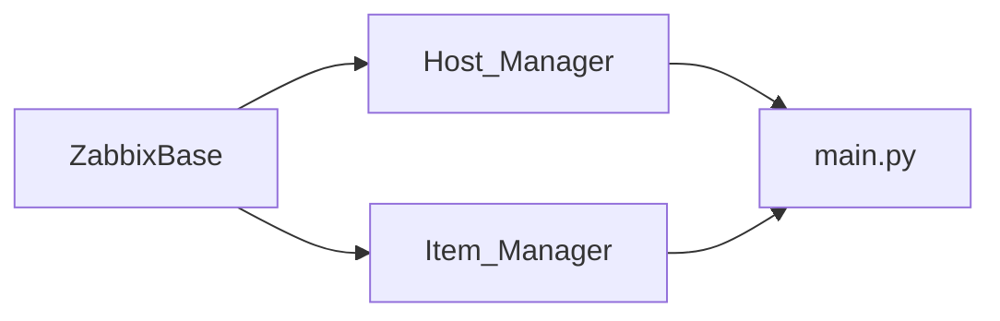

# CLAUDE.md

This file provides guidance to Claude Code (claude.ai/code) when working with code in this repository.

## What this project is

A full-stack DevOps UI for managing a Zabbix monitoring server. The backend exposes a REST API that wraps the Zabbix JSON-RPC API; the frontend is a React SPA that calls it. Primary operations: list/create/delete hosts, add monitoring items and triggers, bulk-import hosts from CSV/XLSX, export inventory to Excel.

The repo is set up for **air-gapped / private-registry** deployment on **OpenShift** (or vanilla Kubernetes), with Helm charts and ArgoCD ApplicationSet across dev / staging / production.

---

## Monorepo layout

```
apps/
  backend/          Python 3.12 / FastAPI
  frontend/         React 18 / Vite / TypeScript / MUI
  filebeat/         Elastic Filebeat 8.17 — ships container logs to Elasticsearch
helm/
  charts/
    backend/        standalone Helm chart
    frontend/       standalone Helm chart
    filebeat/       Filebeat DaemonSet chart
    zabbix-portal/  umbrella chart depending on all three
argocd/             AppProject, Application, ApplicationSet, per-env values
.gitlab/ci/         modular GitLab CI pipeline
```

---

## Development commands

### Backend (from `apps/backend/`)

```bash
python -m venv .venv && source .venv/bin/activate
pip install -r requirements.txt

# Dev server (listens on :6769 — note: NOT 8000, that is for Docker only)
uvicorn main:app --host 0.0.0.0 --port 6769 --reload

# Lint / format
ruff check . && ruff format --check .

# Type-check
mypy . --ignore-missing-imports
```

### Frontend (from repo root — pnpm workspaces)

```bash
pnpm install

# Dev only this app (Vite on :42069, proxies /api → :6769)
pnpm --filter @zabbix-portal/frontend dev

# Build / lint / typecheck via Turborepo (cached)
pnpm turbo build     --filter=@zabbix-portal/frontend
pnpm turbo lint      --filter=@zabbix-portal/frontend   # Biome
pnpm turbo typecheck --filter=@zabbix-portal/frontend   # tsc

# Format whole repo
pnpm format
```

### Docker (from repo root)

```bash
# Backend — build context is apps/backend/
docker build -t zabbix-portal-backend apps/backend/

# Frontend — build context is repo root (Turborepo prune requires it)
docker build -f apps/frontend/Dockerfile -t zabbix-portal-frontend .

# Filebeat — build context is apps/filebeat/
docker build -t zabbix-portal-filebeat apps/filebeat/

# Full stack (backend + frontend + Elasticsearch + Filebeat)
docker compose up --build
```

---

## Backend architecture



- **`ZabbixBase`** loads `apps/backend/.env` and creates a `zabbix_utils.ZabbixAPI` session. All managers inherit from it. `self.zapi` is `None` when Zabbix is unreachable — callers must guard against this.
- **`Host_Manager`** wraps host CRUD and Excel export (`openpyxl` / `pandas`).
- **`Item_Manager`** wraps item and trigger creation. Trigger expressions follow Zabbix 5.x classic format: `{hostname:item_key.last()} operator threshold`.
- **`main.py`** instantiates one `Host_Manager` and one `Item_Manager` at module load time (module-level singletons). There is no dependency injection.
- FastAPI runs on **port 6769** locally (`__main__` block) and **port 8000** in Docker/Kubernetes.

Required `.env` variables at `apps/backend/.env`:

```
ZABBIX_URL=http://your-zabbix-server
ZABBIX_USER=Admin
ZABBIX_PASS=zabbix
```

The URL is normalised — either `http://host` or `http://host/api_jsonrpc.php` works.

---

## Frontend architecture

- All API calls go through the thin client in `src/app/api.ts`. Every call is prefixed with `/api` — in dev Vite proxies this to `http://localhost:6769`; in production the Ingress routes `/api/` to the backend service.
- Routing: `src/app/Router.tsx` (React Router v6). Three pages: `Overview`, `Hosts`, `Items`.
- Theme: `src/app/theme.ts` (MUI v5).
- Shell: `src/app/layout/AppShell.tsx`.
- No global state manager — components call `api.*` directly.

---

## Private network / OpenShift conventions

- **Every `FROM` line** in Dockerfiles has a `# PRIVATE NETWORK:` comment with the exact image and the format for an Artifactory replacement. Do not change images without preserving these comments.
- **npm packages are pinned to exact versions** (no `^` or `~`) in `package.json` files. `.npmrc` enforces `frozen-lockfile=true` and disables peer auto-install. The commented-out `registry=` line is where to point at a private npm proxy.
- **pip packages** must be fetched from an internal PyPI proxy. The `pip install` line in `apps/backend/Dockerfile` has a commented `--index-url` flag ready to uncomment.
- The frontend runs on **port 8080** under `serve@14.2.4` (not nginx). This is required for OpenShift's `restricted` SCC: non-root, unprivileged port, random UID with GID 0. Files are `chown 1001:0` and `chmod g=u` so any UID in group 0 can read them.
- `apps/frontend/nginx.conf` exists but is **not used** by the container — kept only as a reference for standalone nginx.

---

## Helm

- Sub-charts (`backend/`, `frontend/`, `filebeat/`) are deployable independently.
- The umbrella chart (`zabbix-portal/`) depends on all three via `file://` references. Always run `helm dependency build helm/charts/zabbix-portal/` before templating or installing it.
- The frontend chart's `apiProxy.enabled: true` adds an `/api/` path rule to the Ingress that routes to the backend service — this replaces the nginx `proxy_pass` that used to live in the container. The backend service name is auto-derived as `<release-name>-zabbix-portal-backend`.
- Sensitive Zabbix credentials are expected in an existing Secret named `zabbix-portal-backend-secret` (set via `existingSecret`). The chart only renders its own `secret.yaml` when `existingSecret` is empty.
- Probes target port `8080` on the frontend and `/health` on port `8000` on the backend.
- The Filebeat chart deploys a DaemonSet. It reads the Elasticsearch password from a Secret named `filebeat-elasticsearch-secret` (key: `ELASTICSEARCH_PASSWORD`). The Elasticsearch host is set via `elasticsearch.hosts` in `values.yaml` — see the `# PRIVATE NETWORK:` comment there. On OpenShift, grant the `hostmount-anyuid` SCC to the Filebeat ServiceAccount before deploying.

---

## GitLab CI pipeline

`.gitlab-ci.yml` declares stages `[.pre, lint, build, staging, production, dr, cleanup]` and includes seven files from `.gitlab/ci/`:

- **`common.yml`** — **the only file you edit when adapting to a new project.** All paths, image names, Helm keys, ArgoCD app names, environment URLs, tooling versions, and `ROOT_JS_CONFIGS` live here.
- **`detect.yml`** — diffs current tag vs. previous tag; emits `BACKEND_CHANGED` / `FRONTEND_CHANGED` / `FILEBEAT_CHANGED` / `HELM_CHANGED` dotenv vars. Downstream jobs skip when their app is untouched.
- **`python.yml`** — ruff lint, mypy, Docker build + push for `BACKEND_IMAGE`.
- **`node.yml`** — Biome lint, tsc typecheck, Turborepo build, Docker build + push for `FRONTEND_IMAGE`.
- **`elastic.yml`** — Docker build + push for `FILEBEAT_IMAGE` (no lint stage; gated on `FILEBEAT_CHANGED`).
- **`gitops.yml`** — `helm lint` + `helm template`; auto `deploy:staging`; manual `deploy:production`; manual `deploy:dr`. All three deploy scripts pin all three image tags per-app.
- **`cleanup.yml`** — manual `cleanup:registry` prunes old image tags via GitLab API.

The pipeline fires **only on tag pushes**. Branch pushes and MR merges do nothing. Required CI variables: `ARGOCD_SERVER`, `ARGOCD_AUTH_TOKEN`, plus GitLab's built-in `CI_REGISTRY_*`.

---

## Image promotion

- **`:vX.Y.Z`** — pushed on every tag push for apps that changed. Production and DR are pinned to a specific tag via `argocd app set` and never auto-update.
- **`:latest`** — updated alongside `:vX.Y.Z` on every tag push. Staging points at this by default; also used as a Docker build cache source.

---

## Things to know before editing

- The frontend Docker build context **must be the repo root**, not `apps/frontend/` — `turbo prune` needs the full workspace to compute the pruned dependency graph.
- When you change Helm values that drive in-cluster behaviour, also bump the chart's `version:` in `Chart.yaml` so ArgoCD detects the change as a new revision.
- Don't reintroduce nginx in the frontend container without thinking through OpenShift compatibility — the standard nginx image runs as root and binds port 80, both of which fail under the `restricted` SCC.
- Don't change `package.json` versions to `^x.y.z` ranges — see [`README.md`](./README.md#private-network--openshift) for why exact pinning matters in this environment.
- When adding a new app to the pipeline, you need to touch exactly four things: (1) add its path/image/helm-key variables to `common.yml`; (2) add its `_CHANGED` detection line to `detect.yml`; (3) create a new CI file for its build job; (4) add its `--helm-set` block to all three deploy scripts in `gitops.yml`.
- The Filebeat DaemonSet version (`FILEBEAT_VERSION` in `common.yml`) must stay in sync with the `FROM` tag in `apps/filebeat/Dockerfile` and the `image.tag` in `helm/charts/filebeat/values.yaml`.

---

## Related docs

- [`README.md`](./README.md) — project overview and quick start
- [`WORKFLOW.md`](./WORKFLOW.md) — end-to-end development and CI/CD pipeline
- [`RELEASING.md`](./RELEASING.md) — release / rollback runbook
