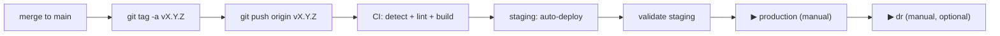

# Releasing

How to ship code changes — from a single bug-fix commit to a tagged production release.

> **The CI/CD pipeline runs ONLY on git tag pushes.** Branch pushes and merge requests do nothing in CI. The tag *is* the release. Until you tag, nothing is built, nothing is deployed.
>
> **Deployment runs via direct `helm upgrade --install` from CI.** ArgoCD manifests in `argocd/` are the planned future path but are not yet wired into the pipeline — every command below uses Helm.

If you only want to understand what the pipeline does, read [`WORKFLOW.md`](./WORKFLOW.md). This document is a runbook — what commands to run, in what order, when something needs to ship.

---

## Quick reference

| I want to…                              | Do this                                                  |
| --------------------------------------- | -------------------------------------------------------- |
| Ship a release                          | Push a git tag — manually or via the workspace tool.     |
| Roll production back                    | `helm rollback` to a previous revision (see §6).         |
| Hotfix production                       | Branch from the production tag → tag a new patch.        |
| Bump only the Helm chart                | Tag a release — only `helm/` changed since the last tag. |
| Validate locally before tagging         | `npm run lint && npm run typecheck` (frontend) + `ruff check . && mypy .` (backend) + `helm lint helm/charts/*`. |

---

## 1. Prerequisites

Before your first release ensure:

- You have **Maintainer** access on the GitLab project.
- These CI variables are configured (Settings → CI/CD → Variables, masked + protected):
  - `K8S_NAMESPACE` — target namespace (pre-created in OpenShift)
  - `STAGING_SERVER` / `STAGING_TOKEN` — staging cluster API URL + service-account token
  - `PROD_SERVER` / `PROD_TOKEN` — production cluster API URL + token (DR reuses these by default)
  - `STAGING_URL` / `PRODUCTION_URL` / `DR_URL` — environment URLs shown in the GitLab environment tab
- The container registry is reachable from the GitLab runners and from each cluster.
- The Artifactory registry path is set where the pipeline pushes/pulls images (search `<your-artifactory-registry>` — see [`PRIVATE_NETWORK.md`](./PRIVATE_NETWORK.md)).
- See [`.cienv-example`](./.cienv-example) for the full list of CI variables.

`validate:variables` in the `.pre` stage hard-fails the pipeline if any required cluster variable is missing, so a misconfiguration is caught before any build runs.

---

## 2. Standard release flow



### 2.1 Prepare your changes

Branch off `main`, make changes, push the branch, open an MR, get it reviewed, merge it. **None of these steps trigger CI.** They are all local / GitLab-side coordination.

```bash
git checkout main && git pull
git checkout -b feature/<short-description>
# ...edit code...

# Validate locally — same checks CI runs (when it eventually does)
cd apps/frontend && npm run lint && npm run typecheck
cd apps/backend  && ruff check . && mypy . --ignore-missing-imports
helm lint helm/charts/{backend,frontend,zabbix-portal}    # if you touched Helm

git commit -am "feat: <subject>"
git push -u origin feature/<short-description>
# ...open MR, review, squash-merge...
```

After a merge to `main` nothing happens automatically. The release happens only when you tag.

### 2.2 Cut the release tag

You have two ways to create the tag — pick whichever is more convenient.

#### Option A — manual `git tag`

```bash
git checkout main && git pull

# Annotated tag with a release note
git tag -a v1.4.0 -m "Release 1.4.0 — <one-line summary>"

# Push the tag — this is what fires CI
git push origin v1.4.0
```

#### Option B — npm version

```bash
# From apps/frontend/ or the repo root
npm version 1.4.0 -m "chore: release v%s" && git push --follow-tags
```

Whatever tool you use, the moment a tag lands on the remote, CI starts.

### 2.3 What CI does on the tag

1. **`detect`** (`.pre` stage) — compares the new tag against the previous ancestor tag and emits per-app `BACKEND_CHANGED` / `FRONTEND_CHANGED` / `HELM_CHANGED` flags. `validate:variables` checks required CI variables are set.
2. **`lint` stage** — ruff, mypy, Biome, tsc, helm lint/template run only for apps that changed.
3. **`build` stage** — Kaniko builds Docker images for changed apps and pushes them tagged `:<git-tag>`.
4. **`staging` stage** — `deploy:staging` runs `helm upgrade --install` against the staging cluster, pinning changed apps to the new tag and keeping unchanged apps on their last-deployed tag.
5. **`production` stage** — `deploy:production` is a manual gate. Click ▶ when staging looks good.
6. **`dr` stage** — `deploy:dr` is a manual gate to mirror production to the DR namespace/cluster.

### 2.4 Validate on staging

Spot-check the change in the staging UI. Watch the deployment:

```bash
helm status     "$PROJECT_NAME" -n "$STAGING_NAMESPACE"
helm history    "$PROJECT_NAME" -n "$STAGING_NAMESPACE"
kubectl -n "$STAGING_NAMESPACE" rollout status deploy/"$PROJECT_NAME"-zabbix-portal-frontend
```

If something is wrong: see §6 to roll back, then fix and re-tag.

### 2.5 Promote to production

Open the pipeline in GitLab → click ▶ on `deploy:production`. The job runs the same `helm upgrade --install` as staging, against the production cluster:

```bash
helm upgrade --install "$PROJECT_NAME" "helm/charts/$PROJECT_NAME/" \
  --namespace "$K8S_NAMESPACE" \
  -f values.yaml -f values-production.yaml \
  --set backend.image.tag=<resolved> \
  --set frontend.image.tag=<resolved> \
  --wait --timeout 5m
```

Only apps that changed since the previous tag are pinned to the new tag; unchanged apps keep whatever tag was last deployed (read back from `helm history`). If `--wait` times out or a pod fails its readiness probe, the job fails and production stays on the old release.

---

## 3. Versioning rules (semver)

`vMAJOR.MINOR.PATCH`. No pre-release suffixes — every tag is a real release.

| Change                                                  | Bump  |
| ------------------------------------------------------- | ----- |
| Breaking API change, breaking config / values change    | MAJOR |
| New feature, new API endpoint, new Helm value           | MINOR |
| Bug fix, security patch, dependency bump, doc-only      | PATCH |

### Helm chart versions

Two distinct fields in each `Chart.yaml`:

- **`version:`** — the Helm chart version. Bump on **any** chart change.
- **`appVersion:`** — the application version this chart was authored for.

When you cut release `v1.4.0`, also update `appVersion: "1.4.0"` in:

- `helm/charts/backend/Chart.yaml`
- `helm/charts/frontend/Chart.yaml`
- `helm/charts/zabbix-portal/Chart.yaml`

…and bump each `version:` field by at least a patch level. Commit those changes to `main` **before** creating the tag, so the tag captures the matching chart version.

---

## 4. Hotfix flow

When production has a critical bug and `main` has unrelated unfinished work:

```bash
# Branch off the released tag, not main
git checkout v1.4.0
git checkout -b hotfix/v1.4.1

# ...minimal fix...
cd apps/frontend && npm run lint && npm run typecheck
cd apps/backend  && ruff check . && mypy . --ignore-missing-imports

git commit -am "fix: <subject>"
git push -u origin hotfix/v1.4.1

# Open MR targeting main, get it reviewed and merged (no CI runs)
# Then tag from the merge commit on main:
git checkout main && git pull
git tag -a v1.4.1 -m "Hotfix 1.4.1 — <subject>"
git push origin v1.4.1
```

The tag push is what fires CI. Detection diffs `v1.4.0..v1.4.1` and only the apps that actually changed get rebuilt. Click the manual production gate to ship.

---

## 5. Per-app releases

Per-app releases are automatic — no extra ceremony required. The detect job diffs the new tag against the previous tag and only the apps with actual code changes get rebuilt and re-pinned.

| Scenario                                              | Backend | Frontend |
| ----------------------------------------------------- | ------- | -------- |
| Tag with backend-only changes since last tag          | rebuilt | unchanged |
| Tag with frontend-only changes                        | unchanged | rebuilt |
| Tag with changes to both                              | rebuilt | rebuilt |
| Tag with only `helm/` changes (no app code)           | unchanged | unchanged |
| First-ever tag (no previous tag to diff against)      | rebuilt | rebuilt |

In each deploy job, the same diff drives `helm --set image.tag`: only changed apps are pinned to the new tag. Unchanged apps keep the tag read back from `helm history`.

---

## 6. Rollback procedures

There is no automatic rollback. Production stays on whatever was last deployed, even if `main` advances.

### 6.1 Roll back to the previous Helm revision

Each successful `helm upgrade` is a revision. Roll back in one command:

```bash
helm history  "$PROJECT_NAME" -n "$K8S_NAMESPACE"
helm rollback "$PROJECT_NAME" <REVISION_NUMBER> -n "$K8S_NAMESPACE" --wait --timeout 5m
```

This restores both the chart and the values (including the image tags) to that revision. This is the recommended path during an incident — no Git revert required. Open a follow-up MR afterwards to revert the offending commits in source so the next tag does not reintroduce the bad code.

### 6.2 Roll forward to a specific known-good tag

If you'd rather re-deploy an explicit older tag than step back a revision:

```bash
helm upgrade --install "$PROJECT_NAME" "helm/charts/$PROJECT_NAME/" \
  --namespace "$K8S_NAMESPACE" \
  -f values.yaml -f values-production.yaml \
  --set backend.image.tag=v1.3.0 \
  --set frontend.image.tag=v1.3.0 \
  --wait --timeout 5m
```

### 6.3 Roll back staging

Re-run the previous tag's pipeline, `helm rollback` staging, or tag a new patch release that reverts the bad commits.

---

## 7. Pre-flight checklist before tagging

- [ ] Code merged to `main` and the tip of `main` builds locally
- [ ] `npm run lint && npm run typecheck` passes in `apps/frontend/`
- [ ] `ruff check . && mypy . --ignore-missing-imports` passes in `apps/backend/`
- [ ] `helm lint helm/charts/{backend,frontend,zabbix-portal}` passes
- [ ] `Chart.yaml` `version:` and `appVersion:` are bumped
- [ ] Any new Helm values are documented in `helm/charts/zabbix-portal/values.yaml` with comments
- [ ] Breaking changes are flagged in the tag annotation message
- [ ] At least one other maintainer has reviewed the diff against the previous tag:

  ```bash
  git log v1.3.0..main --oneline
  ```

- [ ] Database / external system migrations (if any) are already applied to production

When all true: create the tag, push it, then click the production gate when staging looks good.

---

## 8. Why tag-only?

In this repository, **only tags are releases**. There is no "auto-deploy on `main`" path. This is deliberate:

- `main` is allowed to be in flux — features can land without being immediately deployed to staging or production.
- Every deploy is intentional and traceable to a tag with a release note.
- Per-app detection always has a clean comparison base (`previous tag → current tag`), so noise from intermediate commits never enters the deploy decision.
- Rolling back is just `helm rollback` to a known-good revision — no need to revert commits in Git first.

If you want feature-branch previews or auto-deploys on `main`, that is a separate workflow you would add on top — not a replacement for this one.
