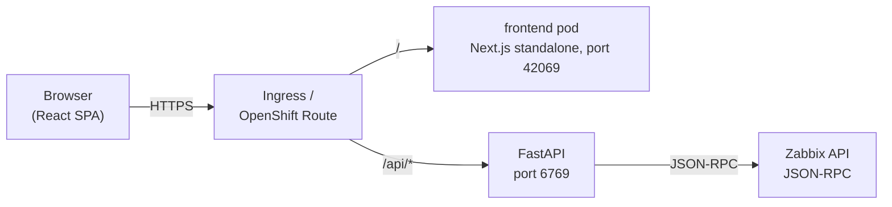
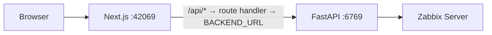
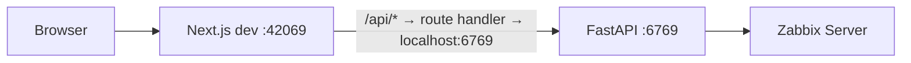
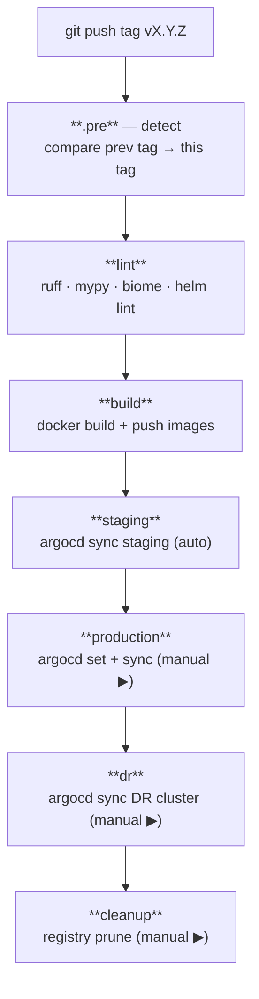
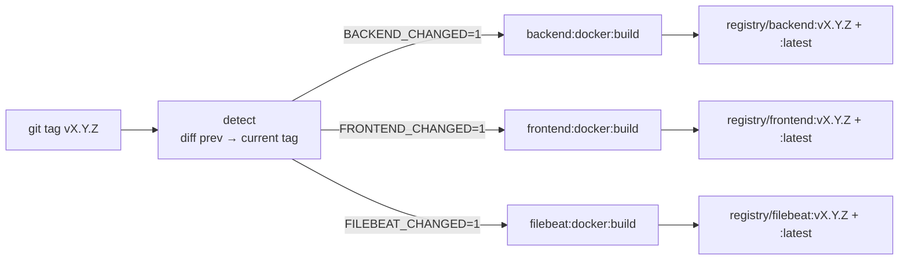
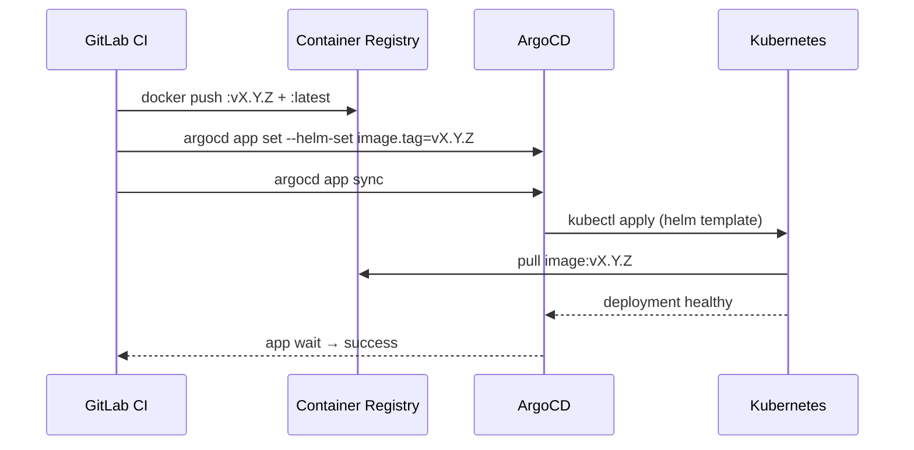
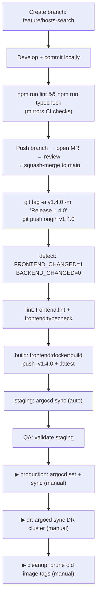

# Workflow

A complete walkthrough of how the Zabbix Portal codebase moves from a developer's laptop into production. This document covers:

1. The runtime request flow (browser → frontend → backend → Zabbix)
2. The local development workflow
3. The Git branching model
4. The GitLab CI pipeline (every stage, every job, every trigger)
5. The container build and image promotion strategy
6. The ArgoCD deployment flow (staging / production / DR)
7. How a single code change traverses all of the above

---

## 1. Runtime request flow

### In Kubernetes / OpenShift



- The Ingress splits traffic by path: `/api/*` → backend, everything else → frontend.
- The frontend container does **not** proxy API calls in-cluster — routing is handled by the Ingress.

### In standalone Docker (local or staging)



- The browser hits the Next.js server directly.
- `/api/*` requests are proxied by the catch-all route handler at `src/app/api/[...path]/route.ts` to `BACKEND_URL` (read from `apps/frontend/.env` at server startup via `src/instrumentation.ts`).

### In local development



Same route handler, same `BACKEND_URL` mechanism — Next.js loads `.env` automatically during `npm run dev`.

---

## 2. Local development workflow

### Daily loop

```bash
# Backend (from apps/backend/)
source .venv/bin/activate
uvicorn Zabbix_Main:app --host 0.0.0.0 --port 6769 --reload

# Frontend (from apps/frontend/)
npm run dev   # Next.js on :42069
```

### Pre-commit checks

```bash
# From apps/frontend/
npm run lint       # Biome
npm run typecheck  # tsc

# From apps/backend/
ruff check . && mypy . --ignore-missing-imports
```

### Editing Helm or ArgoCD

```bash
helm dependency build helm/charts/zabbix-portal/
helm template zabbix-portal helm/charts/zabbix-portal/ --debug | less
helm lint helm/charts/{backend,frontend,zabbix-portal}
```

For ArgoCD manifests, validate with `kubectl apply --dry-run=client -f argocd/`.

---

## 3. Git branching model

| Branch       | Purpose                                             | CI behaviour                              |
| ------------ | --------------------------------------------------- | ----------------------------------------- |
| `main`       | The single source of truth — merged, reviewed code  | **No CI.** Tags trigger CI, not branches. |
| `feature/*`  | Short-lived branches for new work                   | No CI. Validate locally before MR.        |
| `fix/*`      | Bug-fix branches                                    | Same as `feature/*`.                      |
| Tag `vX.Y.Z` | Immutable release marker on a `main` commit         | Full pipeline: lint → build → deploy.     |

Workflow: branch off `main` → develop → lint/typecheck locally → open MR → review → squash-merge to `main` → **tag** to release.

> **The tag is the release.** Branch pushes and MR merges do nothing in CI. Only a `git push origin vX.Y.Z` fires the pipeline.

---

## 4. GitLab CI pipeline

The pipeline is modular. `.gitlab-ci.yml` declares stages and includes six files:

```yaml
stages: [.pre, lint, build, staging, production, dr, cleanup]
include:
  - .gitlab/ci/common.yml    # ALL project-specific variables — the only file to edit per project
  - .gitlab/ci/detect.yml    # change detection
  - .gitlab/ci/python.yml    # backend jobs
  - .gitlab/ci/node.yml      # frontend jobs
  - .gitlab/ci/elastic.yml   # Filebeat jobs
  - .gitlab/ci/gitops.yml    # helm lint + ArgoCD deploy jobs
  - .gitlab/ci/cleanup.yml   # registry cleanup
```

### Pipeline overview



### 4.1 Stage `.pre` — change detection (`detect.yml`)

Runs once at the start of every tag pipeline. Compares the current tag against the most recent ancestor tag and writes four booleans to a dotenv artifact:

```
BACKEND_CHANGED=1
FRONTEND_CHANGED=0
FILEBEAT_CHANGED=0
HELM_CHANGED=0
PREV_TAG=v1.3.0
```

All downstream jobs consume these vars via `artifacts: reports: dotenv`. Jobs for unchanged apps are skipped entirely.

### 4.2 Stage `lint` — fast-fail static checks

| Job                  | Image              | Runs when            | What it does                         |
| -------------------- | ------------------ | -------------------- | ------------------------------------ |
| `backend:lint`       | `python:3.12-slim` | `BACKEND_CHANGED=1`  | `ruff check .` + `ruff format --check .` |
| `backend:typecheck`  | `python:3.12-slim` | `BACKEND_CHANGED=1`  | `mypy . --ignore-missing-imports`    |
| `frontend:lint`      | `node:22-alpine`   | `FRONTEND_CHANGED=1` | `npm run lint` (Biome)               |
| `frontend:typecheck` | same               | `FRONTEND_CHANGED=1` | `npm run typecheck` (tsc)            |
| `helm:lint`          | `alpine/helm`      | `HELM_CHANGED=1`     | `helm lint` on all three charts      |
| `helm:template`      | same               | `HELM_CHANGED=1`     | `helm template` to catch render errors |

### 4.3 Stage `build` — produce images

| Job                      | Runs when            | Output                                             |
| ------------------------ | -------------------- | -------------------------------------------------- |
| `backend:docker:build`   | `BACKEND_CHANGED=1`  | Pushes `$BACKEND_IMAGE:$CI_COMMIT_TAG` + `:latest` |
| `frontend:docker:build`  | `FRONTEND_CHANGED=1` | Pushes `$FRONTEND_IMAGE:$CI_COMMIT_TAG` + `:latest`|
| `filebeat:docker:build`  | `FILEBEAT_CHANGED=1` | Pushes `$FILEBEAT_IMAGE:$CI_COMMIT_TAG` + `:latest`|

All Docker jobs use `--cache-from $IMAGE:latest` and embed OCI labels for traceability.

### 4.4 Stage `staging` — auto-deploy on every tag

`deploy:staging` runs automatically after a successful build:

```bash
argocd app set zabbix-portal-staging \
  [--helm-set zabbix-portal-backend.image.tag=vX.Y.Z]
  [--helm-set zabbix-portal-frontend.image.tag=vX.Y.Z]
  [--helm-set zabbix-portal-filebeat.image.tag=vX.Y.Z]
argocd app sync  zabbix-portal-staging --timeout 300
argocd app wait  zabbix-portal-staging --health --sync --timeout 300
```

### 4.5 Stage `production` — manual gate

`deploy:production` requires a manual click in the GitLab pipeline UI. Same per-app pinning logic as staging.

### 4.6 Stage `dr` — Disaster Recovery (manual gate)

Mirrors the production pinning to a separate DR cluster/Application. Run after production is verified healthy.

### 4.7 Stage `cleanup` — registry maintenance (manual gate)

Prunes stale image tags via the GitLab Container Registry API. Keeps all semver tags and `:latest`, keeps the 10 most recently pushed non-semver tags, deletes non-semver tags older than 7 days.

---

## 5. Container build and image promotion strategy



- **`:vX.Y.Z`** — the only tag promoted to production / DR. Production is pinned explicitly via `argocd app set` and never auto-updates.
- **`:latest`** — updated on every tag push for apps that changed. Used for staging and as a build cache source.

### Frontend Docker build

- Build context is `apps/frontend/` — `docker build -t zabbix-portal-frontend apps/frontend/`.
- Multi-stage: `builder` (npm install + next build) → `runner` (Next.js standalone, `node server.js`, port 42069).
- `apps/frontend/.env` is copied into the image (not excluded by `.dockerignore`) and loaded at server startup by `src/instrumentation.ts` via `dotenv.config()`.
- Set `BACKEND_URL` in `apps/frontend/.env` to match the deployment target before building.

---

## 6. ArgoCD deployment flow



- **staging**: `automated.prune: true`, `selfHeal: true` — drift is auto-corrected.
- **production / DR**: `selfHeal: false` — drift is reported but never auto-corrected.

---

## 7. End-to-end: a feature change

Walking through a change to `apps/frontend/src/views/Hosts.tsx`:



Key invariants:

- **Only changed apps rebuild.** If only `apps/frontend/` changed, backend jobs are skipped entirely.
- **Production never auto-updates.** Image promotion is always an explicit `argocd app set` from CI.
- **Rollback is always available.** Re-run `argocd app set` with a previous tag. See `RELEASING.md` for exact commands.
