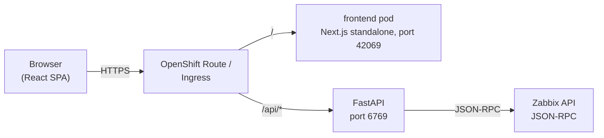
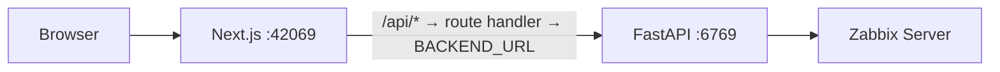
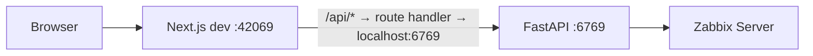
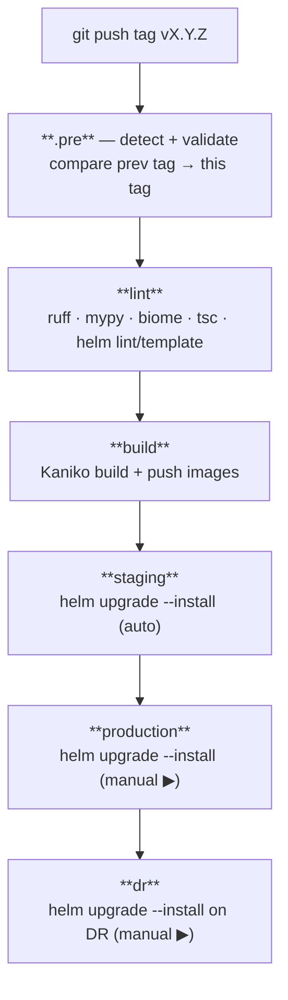
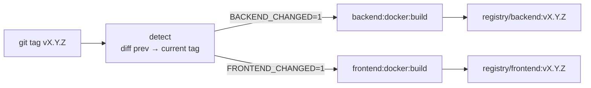
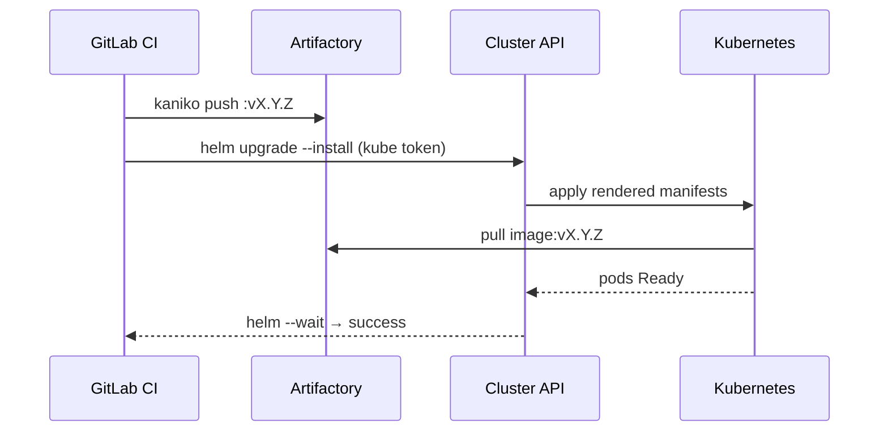
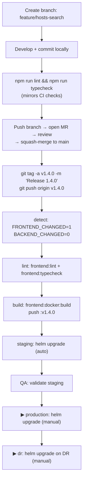

# Workflow

A complete walkthrough of how the Zabbix Portal codebase moves from a developer's laptop into production. This document covers:

1. The runtime request flow (browser → frontend → backend → Zabbix)
2. The local development workflow
3. The Git branching model
4. The GitLab CI pipeline (every stage, every job, every trigger)
5. The container build and image strategy
6. The Helm deployment flow (staging / production / DR)
7. How a single code change traverses all of the above

> **Deployment today runs via direct `helm upgrade --install` from GitLab CI.**
> ArgoCD manifests live in `argocd/` and are the planned future deploy path, but
> they are **not yet wired into the pipeline** — the CI talks to each cluster's
> API directly with a kube token. See §6.

---

## 1. Runtime request flow

### In Kubernetes / OpenShift



- The Route/Ingress splits traffic by path: `/api/*` → backend, everything else → frontend.
- The frontend container does **not** proxy API calls in-cluster — routing is handled by the Route/Ingress.

### In standalone Docker (local)



- The browser hits the Next.js server directly.
- `/api/*` requests are proxied by the catch-all route handler at `src/app/api/[...path]/route.ts` to `BACKEND_URL` (read from `apps/frontend/.env` at server startup via `src/instrumentation.ts`).

### In local development



Same route handler, same `BACKEND_URL` mechanism — Next.js loads `.env` automatically during `npm run dev`.

### Real-time updates

The backend exposes a Server-Sent Events stream at `/events`. The frontend's `SyncContext` subscribes to it and re-fetches data whenever the backend completes a Zabbix sync, so the UI reflects external changes without a manual refresh.

---

## 2. Local development workflow

### First-time setup

PostgreSQL is a **shared/external** database — point `DATABASE_URL` at it. For a throwaway local DB:

```bash
# 1. Start a local PostgreSQL (or point DATABASE_URL at your shared instance)
docker run -d --name pg -p 5432:5432 \
  -e POSTGRES_USER=postgres -e POSTGRES_PASSWORD=postgres -e POSTGRES_DB=zabbix_portal \
  postgres:16

# 2. Create apps/backend/.env (see README.md — Environment files)
# 3. Create apps/frontend/.env with BACKEND_URL=http://localhost:6769
```

### Daily loop

```bash
# Option A — run both app containers with docker compose (from repo root)
#            (postgres is external — set DATABASE_URL in apps/backend/.env)
docker compose up -d --build

# Option B — run each service manually in separate terminals

# Terminal 1 — Backend (from apps/backend/)
source .venv/bin/activate
uvicorn Zabbix_Main:app --host 0.0.0.0 --port 6769 --reload

# Terminal 2 — Frontend (from apps/frontend/)
npm run dev   # Next.js on :42069
```

On first backend startup the schema is created automatically and a root user is seeded
(`ADMIN_USERNAME` / `ADMIN_PASSWORD`, default `Admin` / `admin`). Change the password after first login.

### Pre-commit checks

```bash
# From apps/frontend/
npm run lint       # Biome
npm run typecheck  # tsc

# From apps/backend/
ruff check . && mypy . --ignore-missing-imports
```

### Editing Helm

```bash
helm dependency build helm/charts/zabbix-portal/
helm template zabbix-portal helm/charts/zabbix-portal/ --debug | less
helm lint helm/charts/{backend,frontend,zabbix-portal}
```

---

## 3. Git branching model

| Branch       | Purpose                                             | CI behaviour                              |
| ------------ | --------------------------------------------------- | ----------------------------------------- |
| `main`       | The single source of truth — merged, reviewed code  | **No CI.** Tags trigger CI, not branches. |
| `feature/*`  | Short-lived branches for new work                   | No CI. Validate locally before MR.        |
| `fix/*`      | Bug-fix branches                                    | Same as `feature/*`.                      |
| Tag `vX.Y.Z` | Immutable release marker on a `main` commit         | Full pipeline: lint → build → deploy.     |

Workflow: branch off `main` → develop → lint/typecheck locally → open MR → review → squash-merge to `main` → **tag** to release.

> **The tag is the release.** Branch pushes and MR merges do nothing in CI. Only a `git push origin vX.Y.Z` fires the pipeline.
> (`FORCE_BUILD=1` can be used to run a build/deploy from a branch without a tag — it falls back to the short SHA as the image tag.)

---

## 4. GitLab CI pipeline

The pipeline is modular. `.gitlab-ci.yml` declares stages and includes five files:

```yaml
stages: [.pre, lint, build, staging, production, dr]
include:
  - .gitlab/ci/common.yml    # reusable job templates (runner tag, Kaniko base image)
  - .gitlab/ci/detect.yml    # change detection + variable validation
  - .gitlab/ci/python.yml    # backend jobs
  - .gitlab/ci/node.yml      # frontend jobs
  - .gitlab/ci/gitops.yml    # helm lint/template + helm deploy jobs
```

### Pipeline overview



### 4.1 Stage `.pre` — change detection + validation (`detect.yml`)

`detect` runs once at the start of every tag pipeline. It compares the current tag against the most recent ancestor tag and writes three booleans (+ the previous tag) to a dotenv artifact:

```
BACKEND_CHANGED=1
FRONTEND_CHANGED=0
HELM_CHANGED=0
PREV_TAG=v1.3.0
```

All downstream jobs consume these vars via `artifacts: reports: dotenv`. Jobs for unchanged apps are skipped entirely. On the first-ever tag (or with `FORCE_BUILD=1`) everything is marked changed.

`validate:variables` also runs in `.pre`. It prints all pipeline variables and **hard-fails** if any required cluster variable (`K8S_NAMESPACE`, `STAGING_SERVER`, `PROD_SERVER`, `STAGING_TOKEN`, `PROD_TOKEN`) is missing — surfacing misconfiguration early instead of as a cryptic Helm error later.

### 4.2 Stage `lint` — fast-fail static checks

| Job                  | Image              | Runs when            | What it does                         |
| -------------------- | ------------------ | -------------------- | ------------------------------------ |
| `backend:lint`       | internal Python    | `BACKEND_CHANGED=1`  | `ruff check .` + `ruff format --check .` |
| `backend:typecheck`  | internal Python    | `BACKEND_CHANGED=1`  | `mypy . --ignore-missing-imports`    |
| `frontend:lint`      | internal Node      | `FRONTEND_CHANGED=1` | `npm run lint` (Biome)               |
| `frontend:typecheck` | internal Node      | `FRONTEND_CHANGED=1` | `npm run typecheck` (tsc)            |
| `helm:lint`          | internal Helm      | `HELM_CHANGED=1`     | `helm lint` on all three charts      |
| `helm:template`      | internal Helm      | `HELM_CHANGED=1`     | `helm template` to catch render errors |

The lint and typecheck jobs are currently `allow_failure: true` (advisory). Remove that flag once the codebase is clean if you want them to hard-block a release.

### 4.3 Stage `build` — produce images

Images are built with **Kaniko** (rootless, daemonless — works in restricted CI). Each image is pushed with a single tag: the release tag (`$CI_COMMIT_TAG`), or the short SHA on a `FORCE_BUILD`.

| Job                      | Runs when            | Output                                             |
| ------------------------ | -------------------- | -------------------------------------------------- |
| `backend:docker:build`   | `BACKEND_CHANGED=1`  | Pushes `<registry>/backend:$IMAGE_TAG`             |
| `frontend:docker:build`  | `FRONTEND_CHANGED=1` | Pushes `<registry>/frontend:$IMAGE_TAG`            |

Kaniko layer caching is enabled (`--cache=true --cache-ttl=1440h`).

### 4.4 Stage `staging` — auto-deploy on every tag

`deploy:staging` runs automatically after a successful build. It deploys with Helm directly against the staging cluster API:

```bash
helm upgrade --install "$PROJECT_NAME" "helm/charts/$PROJECT_NAME/" \
  --namespace "$K8S_NAMESPACE" \
  -f values.yaml -f values-staging.yaml \
  --set backend.image.repository=<registry>/backend \
  --set frontend.image.repository=<registry>/frontend \
  --set backend.image.tag=<resolved> \
  --set frontend.image.tag=<resolved> \
  --wait --timeout 5m
# Cluster connection: HELM_KUBEAPISERVER=$STAGING_SERVER, HELM_KUBETOKEN=$STAGING_TOKEN
```

**Per-app tag resolution.** Only apps that changed since the previous tag get pinned to the new tag. For unchanged apps, the deploy script reads the last successfully deployed tag out of `helm history` and re-pins that — so an unchanged app is never accidentally moved. `--wait` blocks until all pods pass their readiness probes; if they don't within the timeout, Helm exits non-zero and the job fails.

### 4.5 Stage `production` — manual gate

`deploy:production` requires a manual click in the GitLab pipeline UI. Same Helm command and per-app pinning logic as staging, pointed at the production cluster (`PROD_SERVER` / `PROD_TOKEN`). On its first deploy to an environment with no Helm history, it falls back to the tags resolved by the staging job (passed forward via a dotenv artifact).

### 4.6 Stage `dr` — Disaster Recovery (manual gate)

`deploy:dr` mirrors production to a DR namespace/cluster. By default it reuses the production cluster variables — change `HELM_KUBEAPISERVER` / `HELM_KUBETOKEN` in the job if DR has its own cluster. Run after production is verified healthy. Falls back to the production-resolved tags on first deploy.

---

## 5. Container build and image strategy



- Images are tagged **only** with the release tag (`vX.Y.Z`), or the short SHA for a `FORCE_BUILD`. There is no `:latest` tag.
- Production and DR are pinned to a specific tag via `helm --set image.tag=` and never auto-update.

### Backend Docker build

- Build context is `apps/backend/`.
- Multi-stage: `builder` (pip install) → runtime (copies only installed packages). Runs as non-root `USER 1001` with GID 0 for OpenShift's `restricted` SCC.

### Frontend Docker build

- Build context is `apps/frontend/` — `docker build -t zabbix-portal-frontend apps/frontend/`.
- Multi-stage: `builder` (`npm ci` + `next build`) → `runner` (Next.js standalone, `node server.js`, port 42069). Runs as non-root `USER 1001`.
- `apps/frontend/.env` is copied into the image and loaded at server startup by `src/instrumentation.ts` via `dotenv.config()`. Set `BACKEND_URL` before building. (In-cluster, the Route handles `/api/*` so this value is unused there.)

---

## 6. Deployment flow

### Today — direct Helm from CI



- `helm upgrade --install` is the unit of deploy. `--wait` is the health gate.
- Rollback is `helm rollback` (see `RELEASING.md`).

### Planned — ArgoCD (not yet active)

The `argocd/` directory contains an AppProject, ApplicationSet, and per-environment values for a future GitOps migration. These manifests are **not applied by the current pipeline**. When you switch over, `deploy:*` jobs would be replaced by `argocd app set` / `argocd app sync`, and ArgoCD would reconcile the cluster from Git. Until then, treat `argocd/` as reference scaffolding.

---

## 7. End-to-end: a feature change

Walking through a change to `apps/frontend/src/views/Hosts.tsx`:



Key invariants:

- **Only changed apps rebuild.** If only `apps/frontend/` changed, backend jobs are skipped entirely.
- **Unchanged apps keep their deployed tag.** The deploy script reads it back from `helm history`.
- **Production never auto-updates.** Each promotion is an explicit manual gate.
- **Rollback is always available.** `helm rollback` to a previous revision. See `RELEASING.md`.
