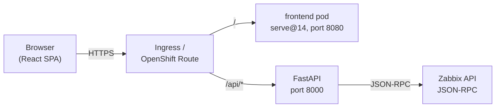
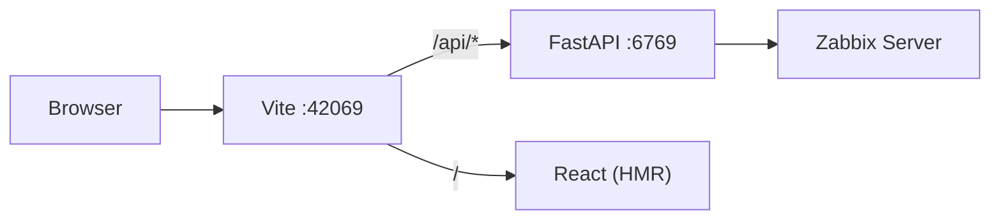
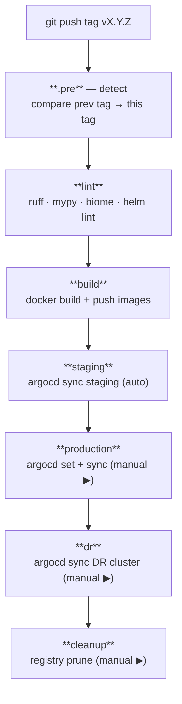
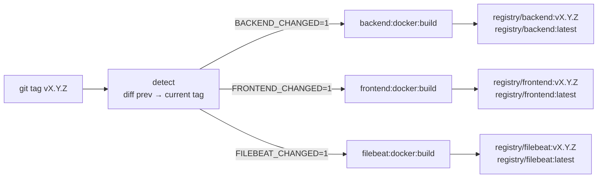
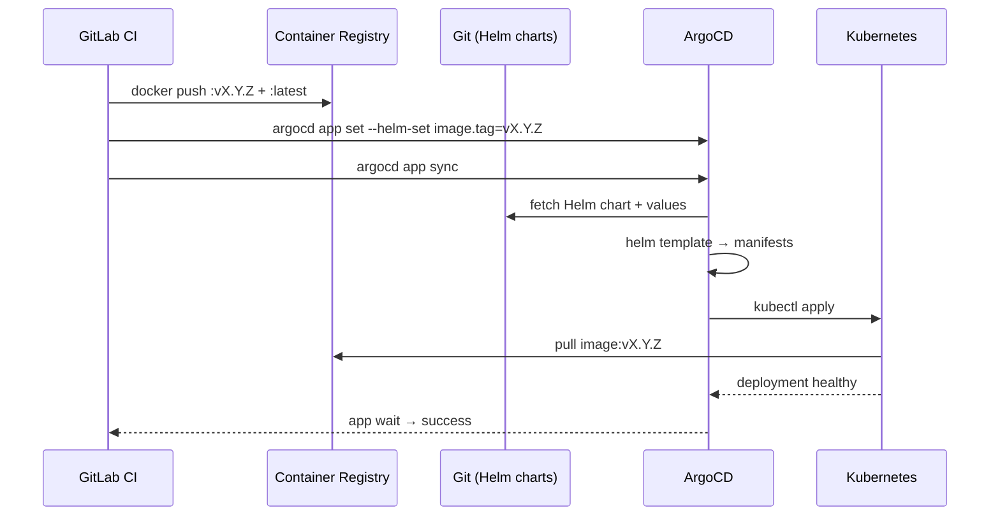
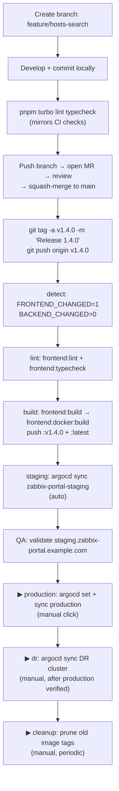

# Workflow

A complete walkthrough of how the Zabbix Portal codebase moves from a developer's laptop into production. This document covers:

1. The runtime request flow (browser → frontend → backend → Zabbix)
2. The local development workflow
3. The Git branching model
4. The GitLab CI pipeline (every stage, every job, every trigger)
5. The container build and image promotion strategy
6. The ArgoCD deployment flow (staging / production / DR)
7. How a single code change traverses all of the above

---

## 1. Runtime request flow



- The browser hits a single hostname (e.g. `zabbix-portal.example.com`).
- The Ingress / OpenShift Route splits traffic by path:
  - `/api/*` → backend service on port 8000
  - everything else → frontend service on port 8080
- The frontend container runs `serve` against the built Vite output. It does **not** proxy to the backend itself — routing is handled by the Ingress, not the container.
- The backend uses `zabbix_utils.ZabbixAPI` to talk to the Zabbix JSON-RPC endpoint defined in its `.env`.

In local development the same model is approximated by Vite's dev-server proxy:



---

## 2. Local development workflow

### Daily loop

```bash
# Once
pnpm install

# Two terminals
pnpm --filter @zabbix-portal/backend dev    # uvicorn :6769
pnpm --filter @zabbix-portal/frontend dev   # vite :42069
```

### Pre-commit checks

The Turborepo pipeline mirrors what CI runs, so you can validate locally with:

```bash
pnpm turbo lint typecheck
```

Turbo caches results — re-running with no changes is near-instant.

### Editing Helm or ArgoCD

```bash
helm dependency build helm/charts/zabbix-portal/
helm template zabbix-portal helm/charts/zabbix-portal/ --debug | less
helm lint helm/charts/{backend,frontend,zabbix-portal}
```

For ArgoCD manifests, validate with `kubectl apply --dry-run=client -f argocd/`.

---

## 3. Git branching model

| Branch       | Purpose                                             | CI behaviour                              |
| ------------ | --------------------------------------------------- | ----------------------------------------- |
| `main`       | The single source of truth — merged, reviewed code  | **No CI.** Tags trigger CI, not branches. |
| `feature/*`  | Short-lived branches for new work                   | No CI. Validate locally before MR.        |
| `fix/*`      | Bug-fix branches                                    | Same as `feature/*`.                      |
| Tag `vX.Y.Z` | Immutable release marker on a `main` commit         | Full pipeline: lint → build → deploy.     |

Workflow: branch off `main` → develop → `pnpm turbo lint typecheck` locally → open MR → review → squash-merge to `main` → **tag** to release.

> **The tag is the release.** Branch pushes and MR merges do nothing in CI. Only a `git push origin vX.Y.Z` fires the pipeline.

---

## 4. GitLab CI pipeline

The pipeline is modular. `.gitlab-ci.yml` declares stages and includes six files:

```yaml
stages: [.pre, lint, build, staging, production, dr, cleanup]
include:
  - .gitlab/ci/common.yml    # ALL project-specific variables — the only file to edit per project
  - .gitlab/ci/detect.yml    # change detection
  - .gitlab/ci/python.yml    # backend jobs
  - .gitlab/ci/node.yml      # frontend jobs
  - .gitlab/ci/elastic.yml   # Filebeat jobs
  - .gitlab/ci/gitops.yml    # helm lint + ArgoCD deploy jobs
  - .gitlab/ci/cleanup.yml   # registry cleanup
```

### Pipeline overview



### 4.1 Stage `.pre` — change detection (`detect.yml`)

Runs once at the start of every tag pipeline. Compares the current tag against the most recent ancestor tag (`git describe --tags --abbrev=0 "${CI_COMMIT_TAG}^"`) and writes four booleans to a dotenv artifact:

```
BACKEND_CHANGED=1    # anything under $BACKEND_PATH changed
FRONTEND_CHANGED=0   # anything under $FRONTEND_PATH or root JS config files changed
FILEBEAT_CHANGED=0   # anything under $FILEBEAT_PATH changed
HELM_CHANGED=0       # anything under $HELM_PATH changed
PREV_TAG=v1.3.0      # the tag we diffed against (empty on first-ever release)
```

All paths and the root JS config file pattern (`ROOT_JS_CONFIGS`) are variables defined in `common.yml` — detection logic itself never needs to change.

All downstream jobs consume these vars via `artifacts: reports: dotenv`. Jobs for unchanged apps are skipped entirely — no wasted runner minutes.

### 4.2 Stage `lint` — fast-fail static checks

Runs in parallel — none depend on each other.

| Job                  | Image                         | Runs when                        | What it does                                               |
| -------------------- | ----------------------------- | -------------------------------- | ---------------------------------------------------------- |
| `backend:lint`       | `python:3.12-slim`            | `BACKEND_CHANGED=1`              | `ruff check .` + `ruff format --check .`                   |
| `backend:typecheck`  | `python:3.12-slim`            | `BACKEND_CHANGED=1`              | `mypy . --ignore-missing-imports`                          |
| `frontend:lint`      | `node:22-alpine` + pnpm cache | `FRONTEND_CHANGED=1`             | `pnpm turbo lint --filter=@zabbix-portal/frontend` (Biome) |
| `frontend:typecheck` | same                          | `FRONTEND_CHANGED=1`             | `pnpm turbo typecheck --filter=@zabbix-portal/frontend`    |
| `helm:lint`          | `alpine/helm:3.17.0`          | `HELM_CHANGED=1`                 | `helm lint` on all three charts                            |
| `helm:template`      | same                          | `HELM_CHANGED=1`                 | `helm template` to catch render errors                     |

### 4.3 Stage `build` — produce images

| Job                      | Runs when            | Output                                                  |
| ------------------------ | -------------------- | ------------------------------------------------------- |
| `frontend:build`         | `FRONTEND_CHANGED=1` | Vite artifact at `apps/frontend/dist/` (1-week expiry)  |
| `backend:docker:build`   | `BACKEND_CHANGED=1`  | Pushes `$BACKEND_IMAGE:$CI_COMMIT_TAG` + `:latest`      |
| `frontend:docker:build`  | `FRONTEND_CHANGED=1` | Pushes `$FRONTEND_IMAGE:$CI_COMMIT_TAG` + `:latest`     |
| `filebeat:docker:build`  | `FILEBEAT_CHANGED=1` | Pushes `$FILEBEAT_IMAGE:$CI_COMMIT_TAG` + `:latest`     |

All Docker jobs use `--cache-from $IMAGE:latest` and embed OCI labels (`revision`, `version`, `created`) for traceability. Filebeat has no lint stage — `apps/filebeat/` contains only a Dockerfile and config file.

### 4.4 Stage `staging` — auto-deploy on every tag

`deploy:staging` runs automatically after a successful build. It pins only the apps that changed:

```bash
argocd app set zabbix-portal-staging \
  [--helm-set zabbix-portal-backend.image.tag=vX.Y.Z]   # only if BACKEND_CHANGED
  [--helm-set zabbix-portal-frontend.image.tag=vX.Y.Z]  # only if FRONTEND_CHANGED
  [--helm-set zabbix-portal-filebeat.image.tag=vX.Y.Z]  # only if FILEBEAT_CHANGED
argocd app sync  zabbix-portal-staging --timeout 300
argocd app wait  zabbix-portal-staging --health --sync --timeout 300
```

### 4.5 Stage `production` — manual gate

`deploy:production` requires a manual click in the GitLab pipeline UI. Same per-app pinning logic as staging. If `argocd app wait` times out or reports `Degraded`, the job fails and production stays on the previous tag.

### 4.6 Stage `dr` — Disaster Recovery (manual gate)

`deploy:dr` mirrors the production pinning to a separate DR cluster/Application. Run it after production is verified healthy. Same per-app detection logic — only changed apps get a new tag in DR.

### 4.7 Stage `cleanup` — registry maintenance (manual gate)

`cleanup:registry` calls the GitLab Container Registry API to prune stale image tags. It:
- **Keeps** all semver tags (`v1.2.3`) and `:latest`
- **Keeps** the 10 most recently pushed non-semver tags per repository
- **Deletes** non-semver tags older than 7 days

GitLab processes the deletion asynchronously. Tune with `REGISTRY_KEEP_TAGS` and `REGISTRY_TAG_TTL_DAYS` CI variables.

---

## 5. Container build and image promotion strategy



- **`:vX.Y.Z`** — the only tag promoted to production / DR. Production is pinned explicitly via `argocd app set` and never auto-updates.
- **`:latest`** — updated on every tag push for apps that changed. Useful for staging and as a build cache source.
- Apps that did **not** change since the previous tag are skipped entirely — their existing image tags remain unchanged in every environment.

### Frontend Docker build specifics

The frontend Dockerfile uses `turbo prune --docker` to produce a minimal build context:

- The build context **must be the repo root** (`docker build -f apps/frontend/Dockerfile .`), not `apps/frontend/`.
- The `pruner` stage emits `out/json/`, `out/full/`, and a pruned `pnpm-lock.yaml` containing only deps reachable from `@zabbix-portal/frontend`.
- The `runner` stage uses `serve@14.2.4` on port 8080 (no nginx — required for OpenShift `restricted` SCC).

---

## 6. ArgoCD deployment flow



### How `argocd/applicationset.yaml` works

A single `ApplicationSet` generates Applications for each environment using a list generator. Each list element supplies `env`, `namespace`, `targetRevision`, replica counts, image tags, ingress hostname suffix, and whether auto-sync is enabled.

### Sync policy

- **staging**: `automated.prune: true`, `selfHeal: true` — drift is auto-corrected.
- **production / DR**: `selfHeal: false` — drift is reported but never auto-corrected. Image tags only move when CI runs `argocd app set`.

---

## 7. End-to-end: a feature change

Walking through the full path of a change to `apps/frontend/src/pages/Hosts.tsx`:



The critical invariants:

- **Only changed apps rebuild.** If only `apps/frontend/` changed, backend jobs are entirely skipped. The backend image tag in every environment stays exactly as it was.
- **Production never auto-updates.** Image promotion is always an explicit `argocd app set` from CI — ArgoCD does not poll the registry.
- **Rollback is always available.** Re-run `argocd app set` with a previous tag — no Git revert required. See `RELEASING.md §6` for the exact commands.
